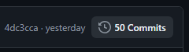
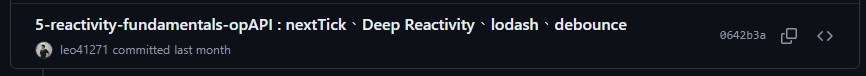
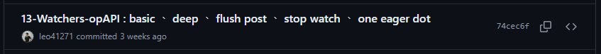
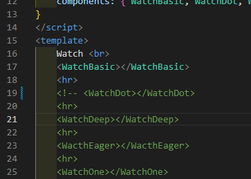

### 前言
在學習 Vue 3 的過程中（包括現在），我發現自己對官網的文檔概念大致上能理解，但要真正向別人講解或是在工作中實際運用時，總是感到有些模糊不清，甚至時常需要反覆查閱。換句話說，其實我並沒有完全理解或掌握文檔中的概念。

此外，我對官方文檔一直有個感覺：對新手（或至少對我而言），它並不太友善。學習過程中經常會遇到大片的文字讓人看不懂，或者是雖然對字面意思有些理解，但當看到程式碼時，卻完全不明白它的作用，這讓我感到非常苦惱。

因此，我嘗試改變學習方式，透過實際動手將文檔中的程式碼概念一一實現出來，以此來具體驗證自己是否真正掌握了這些概念。我也借助了多種管道，例如 Stack Overflow 或 GPT 等方式，花費了大量時間來深入學習與實踐。希望這些經驗與努力對現在閱讀這段文字的你能有所幫助。

# 如何閱讀與學習 (English see below next [part](https://github.com/leo41271/Vue-EcoSystem-Doc-Learn?tab=readme-ov-file#%E5%A6%82%E4%BD%95%E9%96%B1%E8%AE%80%E8%88%87%E5%AD%B8%E7%BF%92-how-to-read-and-learn))
舉例1 如果我想要理解 vue3 官方文檔 option API 之下的 [Reactivity Fundamentals](https://vuejs.org/guide/essentials/reactivity-fundamentals.html)概念與實作。我們可以點進過往的 Commit 紀錄中去尋找 對應的 Commit 訊息。

 >


[5-reactivity-fundamentals-opAPI : nextTick、Deep Reactivity、lodash、debounce
](https://github.com/leo41271/Vue-EcoSystem-Doc-Learn/commit/0642b3a91dbf522a152333d50b59ec999ae5d334)，在此commit訊息中，可以大略知道我做了什麼的實作。

舉例2 如果我想要理解 vue3 官方文檔 option API 之下的 [Watchers](https://vuejs.org/guide/essentials/watchers.html) 概念與實作。也是點入 紀錄尋找對應的 Commit
。

[13-Watchers-opAPI : basic 、 deep 、 flush post 、 stop watch 、 one eager dot](https://github.com/leo41271/Vue-EcoSystem-Doc-Learn/commit/74cec6fda03ff06de5f941a0c9d0dacd6f8683dc)。
點入後可以發現到這次 commit 的內容有些多，可以將本次的內容 git clone 下來到自己電腦本端，自己實際運行看看差異。  
我們可以透過註解的方式，註解掉尚未要觀察的部分，較能詳細觀看 每個單元概念的細節與差異，(有些少許部分因為 console.log 的關係，或是概念很多篇幅很常緣故，這將會導致不易閱讀， 或是 其他變數的部分會互相蓋到、搞混，所以分開 註解 來顯示個別的概念更能清楚了解其內容)如下是比較好理解與閱讀的方式。



所有被上傳的內容我全部都有具體且明確的實際做過並且有確實看到差異。  
如果這對你有幫助希望你能給我一個星星 ★ ，感謝!!

# 如何閱讀與學習 How to read and learn
Example 1: If I want to understand the concept and implementation of [Reactivity Fundamentals](https://vuejs.org/guide/essentials/reactivity-fundamentals.html) in the Vue 3 official documentation under the Option API, we can explore past commit records to find the corresponding commit messages.

 >

In the commit message [13-Watchers-opAPI : basic 、 deep 、 flush post 、 stop watch 、 one eager dot](https://github.com/leo41271/Vue-EcoSystem-Doc-Learn/commit/74cec6fda03ff06de5f941a0c9d0dacd6f8683dc), you can roughly see what I implemented.

Example 2: If I want to understand the concept and implementation of [Watchers](https://vuejs.org/guide/essentials/watchers.html) in the Vue 3 official documentation under the Option API, I would also go into the records to find the corresponding commit.

For instance, the commit message [13-Watchers-opAPI : basic 、 deep 、 flush post 、 stop watch 、 one eager dot](https://github.com/leo41271/Vue-EcoSystem-Doc-Learn/commit/74cec6fda03ff06de5f941a0c9d0dacd6f8683dc) can be used. You’ll notice that this commit contains a lot of content, so you can git clone it to your local machine and run it yourself to observe the differences.

You can comment out the parts you’re not observing yet, which allows you to examine each unit's concept details and differences in more detail. (Due to console.log or extensive content from many concepts, it may be challenging to read. Or, other variables might overlap and cause confusion, so commenting out sections to display individual concepts separately will help to better understand the content.) Here is a better way to understand and read through it:


All the content uploaded was something I specifically and clearly implemented and saw the differences.  
If this helps you, I hope you can give me a star ★. Thanks!

# Vue Official Doc 實作練習檔案布局
```
./src 目錄下
│  App.vue
│  main.js
│  Vue_File_Map_tree.txt
│  
├─components
│  ├─api-doc
│  │  └─api-script-setup-doc
│  │      │  helpers.js
│  │      │  MyComponent.vue
│  │      │  
│  │      ├─Directive
│  │      │      MyDirective.js
│  │      │      
│  │      ├─DynamicCompo
│  │      │      Dynamic-ComponentA.vue
│  │      │      Dynamic-ComponentB.vue
│  │      │      Dynamic-ComponentC.vue
│  │      │      
│  │      ├─ModifierUseGet
│  │      │      ChildGet.vue
│  │      │      Parent.vue
│  │      │      
│  │      └─NamespacedComponents
│  │              form-components.js
│  │              Input.vue
│  │              Label.vue
│  │              
│  ├─com-doc
│  │  ├─async-component
│  │  │  │  Async-BasicUse.vue
│  │  │  │  AsyncDispatcherComponents.vue
│  │  │  │  AsyncDispatcherUseMap.vue
│  │  │  │  AsyncDynamic.vue
│  │  │  │  Error.vue
│  │  │  │  LazyLoad.vue
│  │  │  │  Loading.vue
│  │  │  │  
│  │  │  └─async-components-sets
│  │  │          NoSetAsyncComponent.vue
│  │  │          OneFuncComponent.vue
│  │  │          ThreeFuncComponent.vue
│  │  │          TwoFuncComponent.vue
│  │  │          
│  │  ├─class-and-style-bindings
│  │  │      Basic-Class-Use.vue
│  │  │      Basic-Style-Use.vue
│  │  │      Class-Component.vue
│  │  │      
│  │  ├─components-basic-docs
│  │  │  │  ComponentBasic.vue
│  │  │  │  ComponentEvent.vue
│  │  │  │  ComponentProps.vue
│  │  │  │  ComponentSlot.vue
│  │  │  │  
│  │  │  └─dynamic-components
│  │  │          A.vue
│  │  │          B.vue
│  │  │          C.vue
│  │  │          D.vue
│  │  │          dynamic.js
│  │  │          E.vue
│  │  │          F.vue
│  │  │          packImport.js
│  │  │          
│  │  ├─components-events-docs
│  │  │      EmitArgument.vue
│  │  │      EmitArgument2.vue
│  │  │      EmitArgument3.vue
│  │  │      EmitBasicUse.vue
│  │  │      EmitValidation.vue
│  │  │      
│  │  ├─components-fallthrough-attributes-docs
│  │  │      BasicMyBotton.vue
│  │  │      ClassStyleMerge.vue
│  │  │      ListenerInheritance.vue
│  │  │      RenderListen.vue
│  │  │      RenderListen2.vue
│  │  │      
│  │  ├─components-props-docs
│  │  │      declare-basic-use.vue
│  │  │      declare-basic-use2.vue
│  │  │      Person.js
│  │  │      
│  │  ├─components-provide-inject-docs
│  │  │  │  Child.vue
│  │  │  │  GrandChild.vue
│  │  │  │  ProvideInject.vue
│  │  │  │  
│  │  │  └─injectionKey
│  │  │          Keys.js
│  │  │          
│  │  ├─components-solts-docs
│  │  │      AwesomeIcon.vue
│  │  │      BaseLayout.vue
│  │  │      DynamicSlotName.vue
│  │  │      FancyButton.vue
│  │  │      FancyList.vue
│  │  │      MouseTracker.vue
│  │  │      MyComponent.vue
│  │  │      NameScopeSlot.vue
│  │  │      SubmitButton.vue
│  │  │      
│  │  ├─components-v-model-docs
│  │  │      BasicVModel.vue
│  │  │      MultiBindVModel.vue
│  │  │      VModelArguments.vue
│  │  │      
│  │  ├─computed-properties-docs
│  │  │      ComputedBasic.vue
│  │  │      ComputedWritable.vue
│  │  │      
│  │  ├─custom-directives-docs
│  │  │      Directive.vue
│  │  │      
│  │  ├─event-handling-docs
│  │  │      Event-Argument.vue
│  │  │      Event-Key-Modifiers.vue
│  │  │      Event-Method-Handlers.vue
│  │  │      Event-Modifiers.vue
│  │  │      
│  │  ├─list-rendering-docs
│  │  │      Basic-V-For.vue
│  │  │      For-Array.vue
│  │  │      For-In-Component.vue
│  │  │      TodoItem.vue
│  │  │      
│  │  ├─reactivity-fundamentals-docs
│  │  │      DOM-NextTick.vue
│  │  │      Reactive-Limitation.vue
│  │  │      Reactive.vue
│  │  │      Ref-Deep.vue
│  │  │      Ref-Detial.vue
│  │  │      Why-Ref.vue
│  │  │      
│  │  ├─template-refs-docs
│  │  │      Ref-Basic.vue
│  │  │      Ref-Component.vue
│  │  │      Ref-Function.vue
│  │  │      
│  │  └─watchers-docs
│  │          Watch-Basic.vue
│  │          Watch-Deep.vue
│  │          Watch-Dot.vue
│  │          Watch-Eager.vue
│  │          Watch-Flush-Post.vue
│  │          Watch-Flush-Sync.vue
│  │          Watch-One.vue
│  │          Watch-Source-Types.vue
│  │          Watch-Stop.vue
│  │          WatchEffect.vue
│  │          
│  ├─op-doc
│  │  ├─class-and-style-bindings
│  │  │      Basic-Class-Use.vue
│  │  │      Basic-Style-Use.vue
│  │  │      Class-Component.vue
│  │  │      
│  │  ├─component-docs
│  │  │  │  Alert.vue
│  │  │  │  BlogPost.vue
│  │  │  │  Btn.vue
│  │  │  │  
│  │  │  └─dynamic-components
│  │  │          A.vue
│  │  │          B.vue
│  │  │          C.vue
│  │  │          D.vue
│  │  │          dynamic.js
│  │  │          E.vue
│  │  │          F.vue
│  │  │          
│  │  ├─component-registration-docs
│  │  │      gloalComponentA.vue
│  │  │      gloalComponentB.vue
│  │  │      gloalComponentC.vue
│  │  │      
│  │  ├─components-events-docs
│  │  │      EmitArgument.vue
│  │  │      EmitArgument2.vue
│  │  │      EmitArgument3.vue
│  │  │      EmitBasicUse.vue
│  │  │      EmitValidation.vue
│  │  │      
│  │  ├─components-fallthrough-attributes-docs
│  │  │      BasicMyBotton.vue
│  │  │      ClassStyleMerge.vue
│  │  │      ListenerInheritance.vue
│  │  │      RenderListen.vue
│  │  │      RenderListen2.vue
│  │  │      
│  │  ├─components-props-docs
│  │  │      declare-basic-use.vue
│  │  │      declare-basic-use2.vue
│  │  │      
│  │  ├─components-solts-docs
│  │  │      AwesomeIcon.vue
│  │  │      BaseLayout.vue
│  │  │      DynamicSlotName.vue
│  │  │      FancyButton.vue
│  │  │      FancyList.vue
│  │  │      MouseTracker.vue
│  │  │      MyComponent.vue
│  │  │      NameScopeSlot.vue
│  │  │      SubmitButton.vue
│  │  │      
│  │  ├─components-v-model-docs
│  │  │      Argument-Modifiers.vue
│  │  │      GetSetBind.vue
│  │  │      MultiBindV-model.vue
│  │  │      V-model-Argument.vue
│  │  │      V-model-Modifiers.vue
│  │  │      ValueInputBind.vue
│  │  │      
│  │  ├─computed-properties-docs
│  │  │      Computed-Basic.vue
│  │  │      Computed-Writable.vue
│  │  │      
│  │  ├─event-handling-docs
│  │  │      Event-Argument.vue
│  │  │      Event-Key-Modifiers.vue
│  │  │      Event-Modifiers.vue
│  │  │      
│  │  ├─list-rendering-docs
│  │  │      Basic-V-For.vue
│  │  │      For-Array.vue
│  │  │      For-In-Component.vue
│  │  │      TodoItem.vue
│  │  │      
│  │  ├─template-refs-doc
│  │  │      Ref-Basic.vue
│  │  │      Ref-Component.vue
│  │  │      Ref-Function.vue
│  │  │      
│  │  └─watchers-docs
│  │          Watch-Basic.vue
│  │          Watch-Deep.vue
│  │          Watch-Dot.vue
│  │          Watch-Eager.vue
│  │          Watch-Flush-Post.vue
│  │          Watch-Flush-Sync.vue
│  │          Watch-One.vue
│  │          Watch-Stop-Choose.vue
│  │          Watch-Stop.vue
│  │          
│  └─other
│      ├─question-practice
│      │  └─question1
│      │          ChildComponent.vue
│      │          ParentComponent.vue
│      │          
│      └─style-scoped-show
│              A.vue
│              B.vue
│              
├─composables
│      BasicComposableMouse.js
│      fetch.js
│      Key.js // 沒有上傳
│      KeyExample.js
│      Separate2SmallPiece.js
│      SeparateMouse.js
│      
├─pages
│  ├─com-doc
│  │  │  App-async-components.vue
│  │  │  App-class-and-style-bindings.vue
│  │  │  App-compoments-fallthrough-attributes.vue
│  │  │  App-components-basic.vue
│  │  │  App-components-events.vue
│  │  │  App-components-props.vue
│  │  │  App-components-provide-inject.vue
│  │  │  App-components-slots.vue
│  │  │  App-components-v-model.vue
│  │  │  App-computed-properties.vue
│  │  │  App-conditional-rendering.vue
│  │  │  App-event-handling.vue
│  │  │  App-form-input-bindings.vue
│  │  │  App-list-rendering.vue
│  │  │  App-reactivity-fundamentals.vue
│  │  │  App-template-refs.vue
│  │  │  App-template-syntax.vue
│  │  │  App-watcher.vue
│  │  │  
│  │  └─reusability
│  │          App-composables.vue
│  │          App-custom-directives.vue
│  │          App-plugins.vue
│  │          
│  ├─op-doc
│  │      App-class-and-style-bindings.vue
│  │      App-compoments-fallthrough-attributes.vue
│  │      App-component-registration.vue
│  │      App-components-basics.vue
│  │      App-components-events.vue
│  │      App-components-props.vue
│  │      App-components-slots.vue
│  │      App-components-v-model.vue
│  │      App-computed-properties.vue
│  │      App-conditional-rendering.vue
│  │      App-event-handling.vue
│  │      App-form-input-bindings.vue
│  │      App-list-rendering.vue
│  │      App-reactivity-fundamentals.vue
│  │      App-template-refs.vue
│  │      App-watcher.vue
│  │      
│  └─other
│          globalProperties.vue
│          practice1.vue
│          Promise.vue
│          script-setup-docs.vue
│          style-scoped.vue
│          
└─plugins
        googleTranslate.js
        i18n.js
        noPushToGitKey-Example.js
        noPushToGitKey.js // 沒有上傳
219 個檔案，53 個資料夾。
```